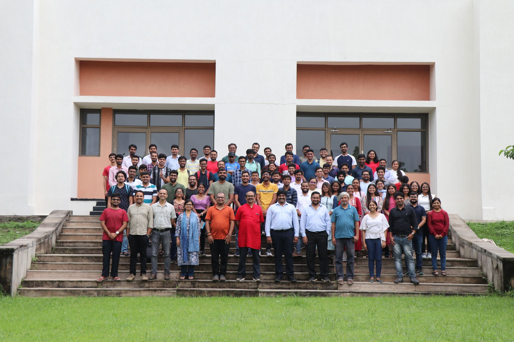
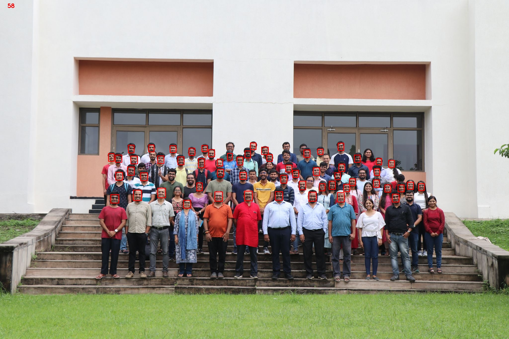
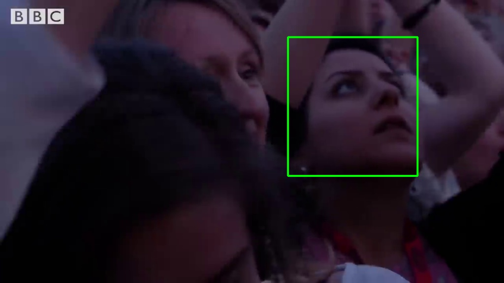
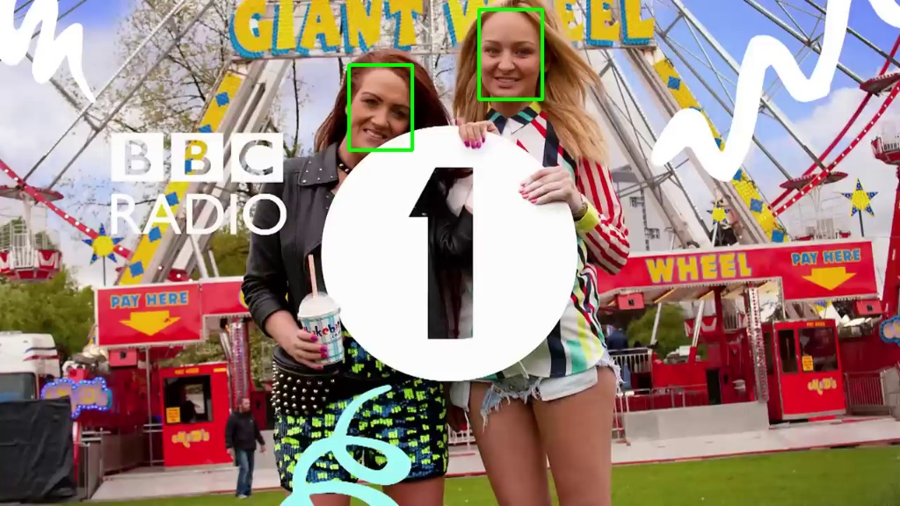
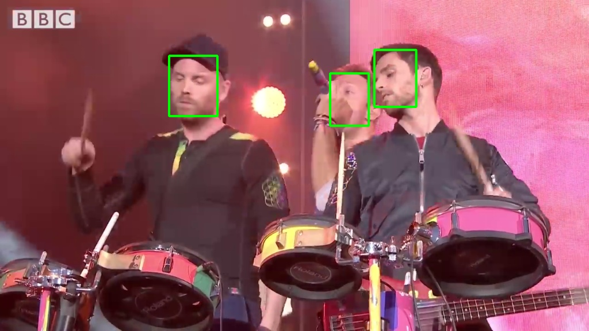
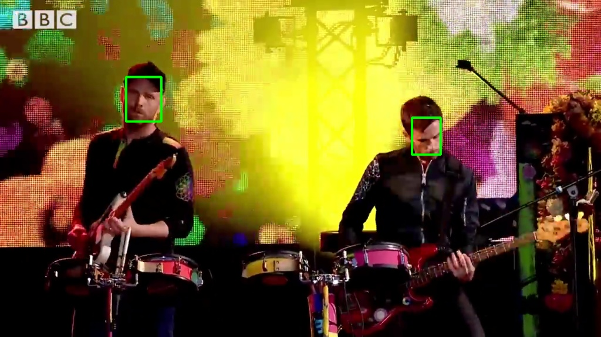
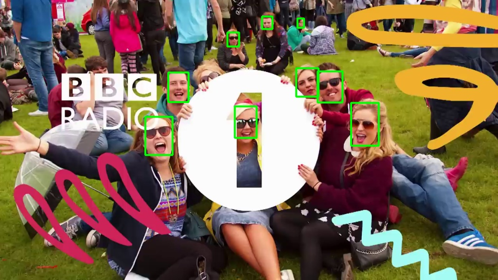
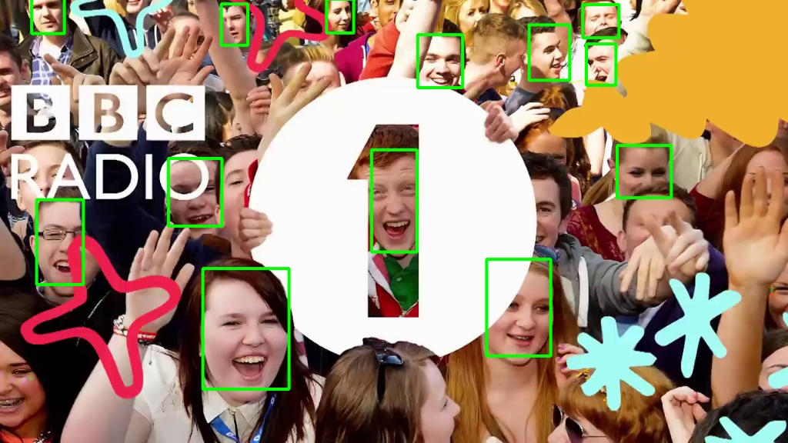

# LeNet-PyTorch with DLProf Profiling

This repository implements the classic **LeNet-5** architecture using PyTorch for digit classification on the MNIST dataset. Additionally, it leverages **NVIDIA DLProf** for performance profiling and optimization, providing insights into GPU utilization and performance bottlenecks.

---

## 📂 Project Structure
- **`lenet.py`**: Main script for training, validation, and testing the LeNet-5 model.
- **`reference.txt`**: Instructions for using Docker and DLProf.
- **`results/`**: Contains profiling results and analysis (e.g., `dlprof_dldb.sqlite`).
- **`examples/`**: Jupyter notebooks for testing or visualizing results.
- **`assets/`**: Images and media for documentation (e.g., graphs, architecture diagrams, and output examples).

---

## 🔑 Key Features
- **LeNet-5 Implementation**: A PyTorch-based implementation of the classic architecture.
- **Data Augmentation**: Techniques like random rotations and crops to improve model generalization.
- **DLProf Integration**: Performance profiling using NVIDIA DLProf for detailed insights.
- **GPU Optimization**: Accelerated training using **apex** for mixed precision.
- **Dockerized Workflow**: Easily reproducible and portable setup with Docker.

---

## 🖼️ Sample Outputs

Here are some sample outputs from the model:

| Original Image                   | Model Prediction               |
| -------------------------------- | ------------------------------ |
|  |  |

Additional examples of predictions:

| Example 1                  | Example 2                  | Example 3                  |
| -------------------------- | -------------------------- | -------------------------- |
|  |  |  |
| Example 4                  | Example 5                  | Example 6                  |
|  |  |  |

---

## 🚀 Getting Started

### Prerequisites
- Python >= 3.6
- PyTorch >= 1.10
- NVIDIA GPU with CUDA support
- Docker (for profiling)

### Installation
1. Clone this repository:
   ```bash
   git clone https://github.com/sarkarsaswata/LeNet-PyTorch-DLProfiler.git
   cd LeNet-PyTorch-DLProfiler
   ```

2. Clone the **[Ultra-Light-Fast-Generic-Face-Detector-1MB](https://github.com/Linzaer/Ultra-Light-Fast-Generic-Face-Detector-1MB)** repository into the directory:
   ```bash
   git clone https://github.com/Linzaer/Ultra-Light-Fast-Generic-Face-Detector-1MB
   ```

3. Build the Docker image:
   ```bash
   docker build . -f Dockerfile --no-cache -t lenet_profiler
   ```

4. Run the profiling script using the provided `run.sh`:
   ```bash
   sh run.sh
   ```

---

## 📊 Profiling with DLProf

### Generating Profiling Data
Run the following command to generate profiling data using DLProf:
```bash
dlprof --mode=pytorch -f true --iter_start 20 --iter_stop 80 python lenet.py
```

### Viewing Profiling Results
Use `dlprofviewer` to visualize the profiling data:
```bash
dlprofviewer dlprof_dldb.sqlite
```

---

## 🛠️ Customization
Feel free to modify:
- **Model**: Experiment with different architectures or hyperparameters in `lenet.py`.
- **Data**: Replace MNIST with other datasets by adapting the `train_transforms` and `test_transforms`.
- **Profiling**: Adjust DLProf parameters for specific profiling scenarios.

---

## 📜 License
This project is licensed under the MIT License.

---